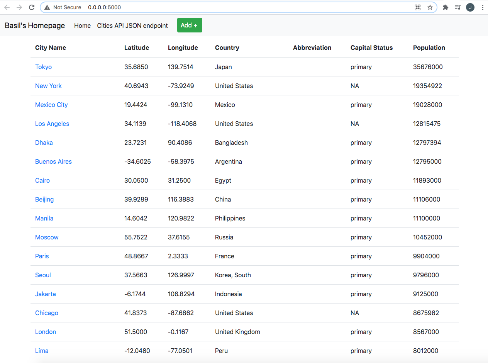

# Project Description
This is part 3 of a project that is a homework assignment to teach how to get Pycharm setup with Docker, Flask, MySQL, and Postman.
I am continuing to try and fix the problems with my docker containers, but as of now here is a picture of Professors]'s file working on my computer. I have added the csv files and everything. My code looks fine. But my docker will not deploy it.

[Download Assignment PDF Here](PPFSQL-Homework.pdf)

[View Assignment Video Here](https://youtu.be/QbMWNgrfAFg)

# Project Part 3 Screenshot

# Project Part 2 Screenshot
 
# Project Query Screenshot
 
# Postman Screenshot

